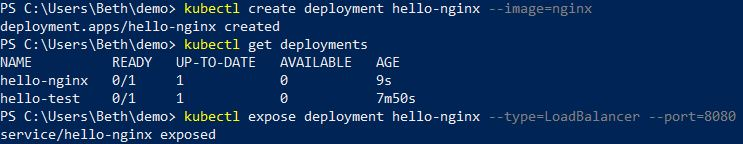
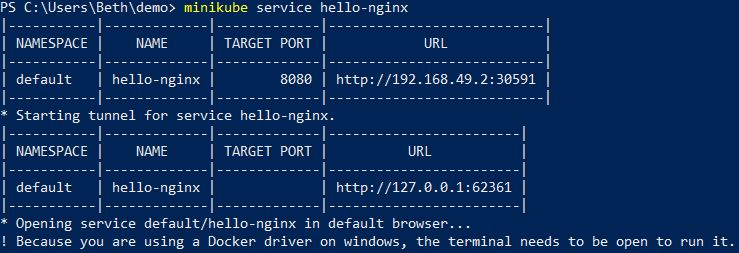
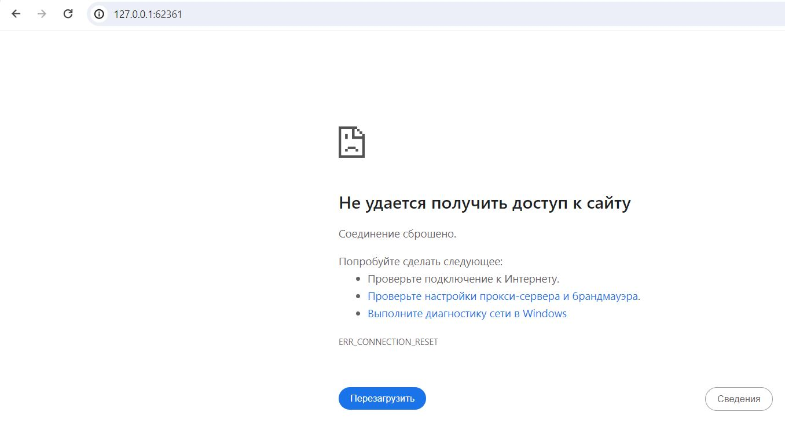

# LabCloud4
В данной работе было необходимо реализовать запуск приложение в Kubernetes с использованием облачного провайдера. Было использовано приложение из первой лабораторной работы (подсчет обращений к странице).
Создаем деплоймент, проверяем его наличие, затем создаем сервис:

Запускаем его, получаем адрес:

Но при проверке в браузере приложение недоступно:

